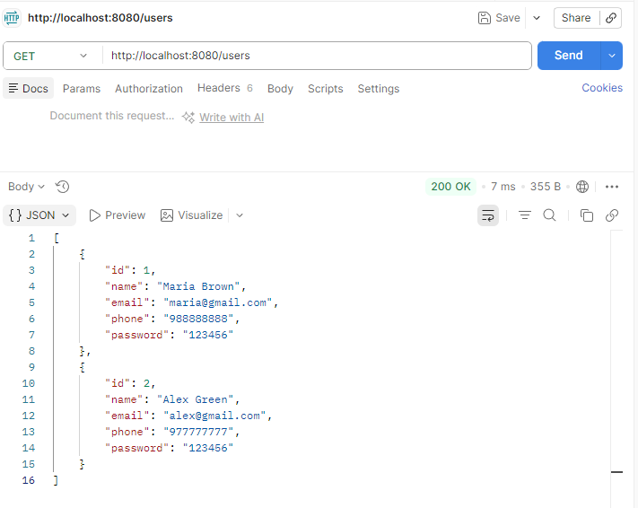
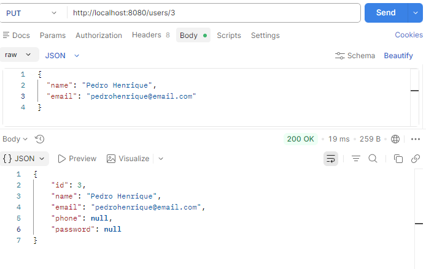
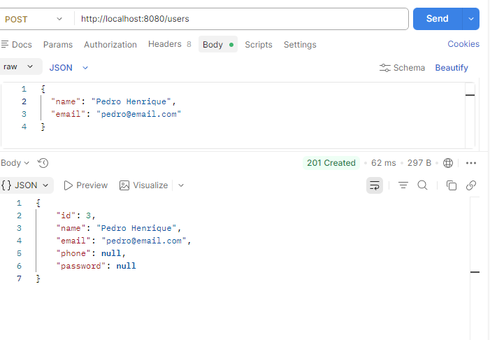
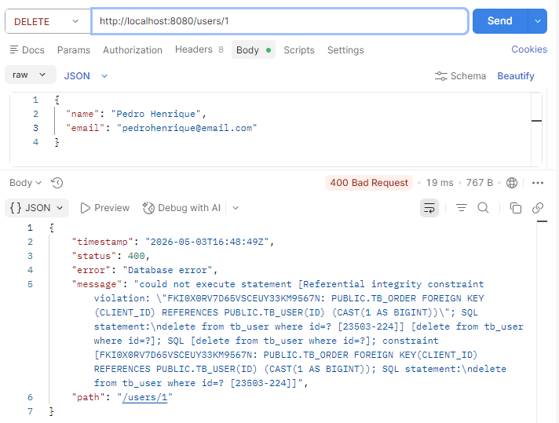

# Spring Web Fundamentals

This project is a demonstration and study application focused on building RESTful APIs using the Spring Boot ecosystem. It serves as a foundation for understanding how Spring manages HTTP requests, dependency injection, and layered architecture.

## 🏗️ Architecture and Class Organization

The project follows the standard layered pattern recommended for Spring applications, ensuring separation of concerns:

### 1. Controllers Layer
Located in the `com.projeto.controllers` package (or similar).
- **Responsibility:** Manage HTTP routes and receive user requests.
- **Main Classes:**
  - `UserController`: Manages CRUD operations for users.
  - `ProductController`: Manages the product catalog.
- **Key Annotations:** `@RestController`, `@RequestMapping`, `@GetMapping`, `@PostMapping`.

### 2. Entities Layer (Domain)
Located in the `com.projeto.entities` package.
- **Responsibility:** Represent the application's data model.
- **Main Classes:**
  - `User`: POJO class that defines user attributes (ID, name, email).
  - `Product`: Defines product attributes.
- **Key Annotations:** `@Entity`, `@Id`, `@GeneratedValue`.

### 3. Services Layer
Located in the `com.projeto.services` package.
- **Responsibility:** Contain the application's business logic. It acts as the bridge between the Controller and the Repository.
- **Main Classes:**
  - `UserService`: Contains methods like `findAll()`, `findById()`, and business validations.
- **Key Annotations:** `@Service`.

### 4. Data Access Layer (Repositories)
Located in the `com.projeto.repositories` package.
- **Responsibility:** Interface responsible for communicating with the data source.
- **Main Classes:**
  - `UserRepository`: Interface that extends `JpaRepository`.
- **Key Annotations:** `@Repository`.

### 5. Configuration and Exceptions
- **ResourceExceptionHandler:** Captures errors in the resource layer and returns user-friendly JSON messages.
- **TestConfig:** Configuration class for the test profile (Database seeding).

## 🛠️ Technologies
- **Java 17+**
- **Spring Boot 3**
- **Maven** (Dependency Manager)
- **H2 Database** (In-memory database for testing)

---

## 📸 API Demonstration

### List Users (GET)

### Update User (PUT)

### Insert User (POST)

### Delete User with dependencies in another table (DELETE)
